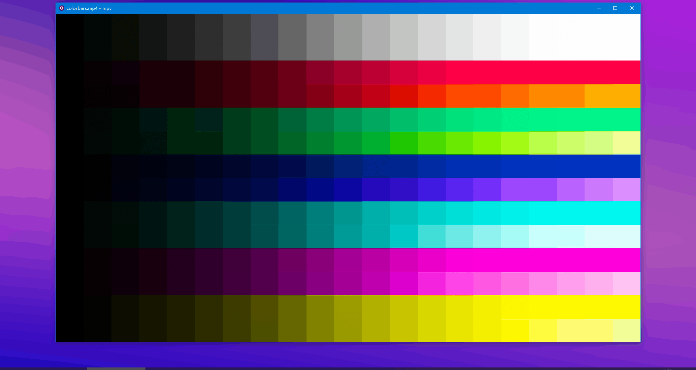

# mpv Picture-in-Picture

## Language
[English](README.md)

[简体中文](README_zh.md)

## About
mpv lua script implements Picture-in-Picture, only for Windows System because it is implemented based on [AutoHotkey](https://www.autohotkey.com/).



## Install
- compile `pip-tool.ahk` to `pip-tool.exe`, see: [Convert a Script to an EXE (Ahk2Exe)](https://www.autohotkey.com/docs/v2/Scripts.htm#ahk2exe) ,\
  or download from [Release](https://github.com/verygoodlee/mpv-pip/releases) page.
- put `pip.lua` into `~~/scripts`, put `pip.conf` into `~~/scripts-opts`, put `pip-tool.exe` into root directory of mpv，like this: 
    ```
    .../mpv/
       │  mpv.exe 
       │  pip-tool.exe
       │  ...
       └─ /portable_config/
          ├─ /scripts/
          │    pip.lua
          ├─ /script-opts/
          │    pip.conf
    ```
## Use
In `pip.conf`, keybinding (default `c` for PiP on/off) window size and window alignment can be modified.\
If you use the [--no-input-default-bindings](https://mpv.io/manual/stable/#options-no-input-default-bindings) option, you need to customize your keybinding in `input.conf`.
```
KEY script-binding pip/toggle
```

## Integrate with other scripts
```lua
mp.commandv('script-message-to', 'pip', 'on')
mp.commandv('script-message-to', 'pip', 'off')
mp.commandv('script-message-to', 'pip', 'toggle')
```

